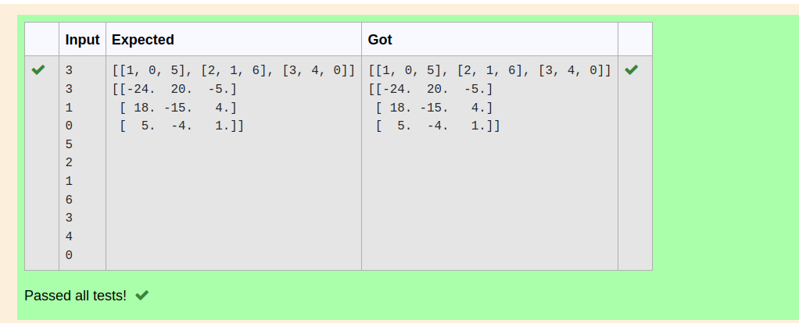

# Inverse-of-matrix

## AIM:
To write a python program to find the inverse of a nested array.
## ALGORITHM:
### Step 1:
Use import numpy as np.
### Step 2:
enter the input.
### Step 3:
use.append().
### Step 4:
use*to multiply two matrix
### Step 5:
print
## PROGRAM:
```python
'''
developed by: vinushcv
reg number: 22001897
'''
import numpy as np
n=int(input())
m=int(input())
l1=[]
l2=[]
for i in range(n):
    for j in range(m):
        l1.append(int(input()))
    l2.append(l1)
    l1=[]
print(l2)
print(np.linalg.inv(l2))
 ```   
## OUTPUT:

## RESULT:
thus the program is written to find the matrix
